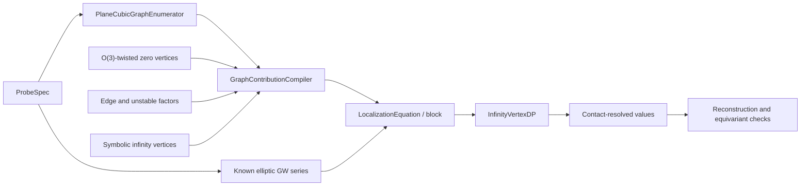

# Roadmap: full log-GLSM equation provider for the plane cubic

## Implementation status

Most of the software architecture in this roadmap is implemented. In particular,
the repository contains `ProbeSpec`, the shared coefficient ring and dimension
engine, universal CJR factors, a complete base-torus localization backend for
`O(3)`-twisted zero vertices, general lambda/psi integration through
`admcycles`, the per-graph compiler, known elliptic probe values, rank-aware
probe selection, field-valued DP, and audit reports.

The CJR punctured unit-removal layer is also implemented in
`cjr_punctured_axioms.sage`: fundamental/unit, string, divisor, and dilaton
relations for a contact-`-1` marking; genus-zero vanishing; the ample
genus-one reduction and explicit one-marked base values; and exact residual
checks in the orchestrator. Disconnected product terms were already encoded
as graph monomials. A splitting relation is intentionally absent because CJR
states it as future work rather than an available axiom.

The aggregate genus-two computation is end to end and reproduces every
requested coefficient of `<pt psi^2>_(2,1,d)`. The contact-resolved compiler
also keeps `(-3)` and `(-2,-2)` as distinct unknowns. It does not yet derive
their individual values from ordinary stationary invariants.

The stabilization-pullback component is implemented. CJR III's log-domain
cotangent line and the Bloch--Okounkov stable-map cotangent line agree on
stable zero components. On a marked unstable zero tail the latter moves to
the corresponding infinity contact; `EffectiveVertex.contact_psi` records its
power and virtual-dimension pruning includes it. Version-5 orchestration
checkpoints are invalidated because they used the smaller vertex basis.

The remaining descendant problem is equation closure: the implemented CJR
unit-removal formulas do not act on arbitrary ordinary cotangent powers at
retained contacts. Stabilized compact probes now compile exact equations in
this enlarged basis, but a finite family can still have a genuine rank defect.

The former mathematical gap has been closed by
`o3_fixed_locus_graphs.sage`. It enumerates the fixed loci of
`Mbar_(g,n)(P^2,d)`, evaluates their virtual-normal and `O(3)` Euler factors,
and sends all contracted-vertex lambda/psi monomials to the vendored
`admcycles` 1.4 backend. The algorithm is finite for every fixed `(g,n,d)`
but grows exponentially; large degrees and high-valence Hodge integrals are
therefore computational, rather than architectural, limits. The
Givental--Teleman stable-graph engine and positive-degree calibration are now
implemented. The small twisted quantum product is computed in flat
coordinates, the degree-zero quantum-Riemann--Roch matrix fixes the Dubrovin
initial condition, and the S-matrix converts ancestors to descendants.
Localization remains the default backend while larger workloads are profiled.

## Target

Given a compact-type elliptic-curve probe and a finite truncation, the final
program should:

1. enumerate every CJR localization graph;
2. attach its exact equivariant contribution;
3. express the result as a polynomial in contact-resolved infinity vertices;
4. obtain the probe's known Gromov--Witten invariant from elliptic-curve
   theory;
5. solve the resulting scalar or block-triangular system with
   `InfinityVertexDP`; and
6. verify the reconstructed invariant, including cancellation of auxiliary
   equivariant parameters.

The first supported scope should remain deliberately precise:

- connected theory of a smooth cubic in `P^2`;
- compact-type ordinary markings and trivial inertia sectors;
- `E=O(3)` with a separate R-torus fiber weight;
- exact rational arithmetic;
- finite bounds on genus, ambient degree, descendant degree, and contact
  length.

The combinatorial and cohomological layers are complete in this scope.  For
the Section 9.3 hypersurface specialization, the remaining mathematical work
is calibration of any basic effective-invariant directions left by exact
rank reduction; the remaining engineering work is performance at large
`(g,n,d)`.  Ordinary contact-descendant relations belong only to the separate
generic stabilized-descendant experiment and are not inputs to Theorem 10.1.



## Current foundation

The following pieces are already present:

- `cjr_bipartite_graphs.sage`: graph topology, decorations, balancing,
  stability, canonical isomorphism classes, automorphisms, and contact
  profiles;
- `log_glsm_infinity_dp.sage`: exact scalar and block-triangular solving;
- `bo_coefficient.sage`: connected stationary elliptic-curve series;
- `cjr_plane_cubic_equation_provider.sage`: the resummed one-point
  stationary provider and the basic all-`-2` diagonal coefficient;
- `elliptic_cubic_gw.py`: plane-cubic degree conventions and elementary
  equivariant `O(3)` weights.
- `o3_fixed_locus_graphs.sage`: full internal stable-map localization for
  every twisted zero vertex;
- `cjr_graph_contributions.sage`: exact graph-to-effective-polynomial
  compilation;
- `cjr_full_equation_provider.sage`: equation extraction and DP integration.
- `cjr_punctured_axioms.sage`: CJR contact-`-1` unit-removal equations and
  low-genus closed inputs.

## Phase 1: freeze conventions and data contracts

This phase should precede further formulas. Most localization bugs are
normalization bugs that otherwise surface only after large graph sums.

### 1.1 `ProbeSpec`

Add an immutable specification containing:

- genus and ambient plane degree;
- labeled ordinary markings;
- for each marking, a cohomology insertion and a psi power;
- connected/disconnected normalization;
- the equivariant coefficient or non-equivariant limit to extract.

For the first implementation, use the basis `(1,H,H^2)` of `H*(P^2)` and a
separate elliptic basis on the known-GW side. The point of the cubic is
represented by `H|_E/3`, since `int_E H=3`; it is not the ambient point class
`H^2`.

### 1.2 coefficient ring

Create one coefficient-ring factory for

```text
QQ(lambda_0, lambda_1, lambda_2, t)
```

and truncated Laurent/power series in the R-weight `t`. No module should
create an independent symbolic `t`. The production path uses the nonresonant
auxiliary path `(0,epsilon,epsilon^2)` and takes `epsilon -> 0` after each
complete fixed-locus sum. A fixed linear ray can make unstable nodal flag
weights cancel identically. Distinct rational weights remain a diagnostic
mode, not the definition of the non-equivariant answer; while `t` remains,
they can retain genuine base-equivariant correction terms.

### 1.3 normalization ledger

Record in executable tests:

- positive edge contact `c` versus the negative infinity contact `-c`;
- the reduced-class sign `(-1)^(1-g+3d)`;
- coarse versus orbifold psi classes (trivial here, but still explicit);
- the convention for `psi_min`;
- inverse Poincare pairing and diagonal factors;
- whether `1/|Aut(Gamma)|` is applied by the compiler or the caller;
- connected versus normalized-disconnected elliptic invariants.

**Completion criterion:** a serialized `ProbeSpec` and a single coefficient
ring can be passed unchanged through every later component.

## Phase 2: dimension and truncation engine

Implement a small exact dimension calculator before expanding any
denominators.

It should compute:

- virtual dimensions of the probe, stable zero vertices, and infinity
  vertices;
- cohomological degrees at markings and flags;
- the allowed powers of edge psi classes and `psi_min`;
- the maximum Laurent order in `t` needed from each factor;
- immediate vanishing from dimension, balance, string, divisor, or dilaton
  constraints.

This makes every graph contribution finite. It should return an explicit
reason when pruning a term; silent truncation is not acceptable.

**Completion criterion:** every infinite-looking denominator expansion has a
provably sufficient finite order attached to it.

## Phase 3: exact universal graph factors

Create `cjr_graph_factors.sage` with small independently tested functions.

### 3.1 edges

For an edge of contact `c`, implement the plane-cubic hypersurface factor

```text
c^c / (c! * (t-3H)^c)
```

together with the appropriate evaluation pullback, cotangent denominator,
and basis expansion needed for gluing. Here `H` is the hyperplane class and
`H_infinity=c1(O(3))=3H`. Keep the unspecialized `H` until the cohomology
pairing is applied.

### 3.2 unstable zero vertices

Implement separate functions for:

- nonspecial vertices;
- marked vertices;
- nodal vertices.

The existing identity

```text
edge(c) * nonspecial_leaf(c)
    = c^(c-1) / (c! * (t-3H)^(c-2))
```

must remain a regression test, including the exact cancellation at `c=2`.

### 3.3 gluing and pairings

Implement the diagonal contraction in the chosen cohomology basis. A graph
with several infinity vertices must produce a product of distinct symbolic
`EffectiveVertex` factors, followed by all basis-label sums and the single
automorphism factor supplied by the graph.

**Completion criterion:** all edge and unstable contributions from the CJR
formula can be evaluated without invoking either the twisted stable-vertex
backend or the DP solver.

## Phase 4: `O(3)`-twisted stable zero-level theory

This phase is implemented. The public request interface is
`TwistedZeroVertexRequest`, evaluated by
`FullTwistedZeroVertexBackend`:

```text
twisted_zero_vertex(
    genus, degree,
    ordinary_insertions,
    flag_insertions,
    flag_psi_powers,
    equivariant_parameters
) -> exact coefficient
```

### 4.1 implemented backend: base-torus localization on `P^2`

`P2FixedLocusGraphEnumerator` uses the `(C*)^3` action on `P^2` and enumerates
ordinary stable-map fixed graphs internal to a zero vertex. It includes:

- vertex assignments to the three fixed points;
- invariant-line edge degrees;
- stable-map deformation and smoothing factors;
- the R-equivariant Euler class of `R pi_* f^* O(3)`;
- marking and flag evaluation classes;
- descendant denominators;
- contracted higher-genus vertex Hodge factors;
- internal automorphisms.

This backend is combinatorially expensive but direct and independently
checkable. It is preferable for the first correct implementation.

### 4.2 implemented Hodge-integral backend

The fixed-graph calculation reduces contracted vertices to Hodge/psi
integrals on `Mbar_(g,n)`. The implementation provides:

- genus-zero psi intersections;
- the lambda-g closed formula where applicable;
- `AdmcyclesHodgeIntegralBackend` for arbitrary top-degree products of
  lambda and psi classes.

The lighter `HodgeIntegralBackend` and `TwistedZeroVertexBackend` remain
available for tests that deliberately exercise unsupported-geometry
diagnostics.

### 4.3 Givental/quantum-Riemann--Roch backend

`givental_teleman.sage` implements the full unit-preserving stable-graph
action of a supplied truncated R-matrix. `o3_givental_teleman.sage` computes
the exact flat small quantum product from genus-zero twisted invariants,
diagonalizes it q-adically, and solves the canonical flatness recursion. The
degree-zero diagonal matrix from Mumford GRR/quantum Riemann--Roch supplies the
otherwise-undetermined integration constants. A separate S-matrix recursion
converts the reconstructed ancestors into stable-map descendants.

The degree-zero reconstruction is cross-checked against virtual localization
through genus two. Positive-degree primary and descendant invariants are
cross-checked in degrees one and two. `HybridTwistedZeroVertexBackend` uses
the calibrated reconstruction where supported and retains localization as a
fallback. The remaining work is performance engineering and broader
coefficient-level regression coverage, not an unresolved R-matrix gauge.

### 4.4 completed low-degree tests

The tests include the line through two points, the conic through five points,
divisor/string/dilaton equations, the genus-one degree-zero mapping-to-a-point
value `-1/8`, the constant rational twist, and full genus-two degree-zero
evaluation. The conic is checked twice: the standard `H^2` lift sums 1,557
fixed components, while cyclic fixed-point-supported lifts reduce the same
invariant to three components.

**Completion criterion: met.** Every stable zero vertex at fixed finite
`(g,n,d)` has an exact localization algorithm, subject only to available
computing time and memory.

## Phase 5: symbolic infinity-vertex expansion

Create a translator from an enumerated infinity vertex to

```text
EffectiveVertex(g, D, contacts, psi_min=k,
                insertions=alpha, contact_psi=b)
```

The current graph enumerator supplies `(g,D,contacts)`. The contribution
compiler must add:

- the finite expansion of `1/(-t-psi_min)`;
- evaluation insertions inherited from incident-edge basis labels;
- ordinary contact cotangent powers inherited from stabilization;
- symmetry under equal decorated contacts;
- dimension pruning of impossible `psi_min` powers;
- positive infinity degrees when allowed by
  `2g-2 >= 3D` (they first matter beyond the genus-two simplification).

Do not aggregate distinct contact profiles at this layer. Aggregation is
allowed only as an explicitly labeled resummation, as in the current
one-point cumulant provider.

**Completion criterion: met.** A graph contribution is a finite exact sum of
monomials in fully indexed `EffectiveVertex` objects.

## Phase 6: graph contribution compiler

Implement

```text
compile_graph(probe, graph) -> GraphContribution
```

where `GraphContribution` contains:

- the stable zero-level value;
- the edge and unstable factors;
- the infinity-vertex monomials;
- the automorphism factor;
- a provenance record showing every factor and truncation decision.

Then implement

```text
compile_probe(probe) -> LocalizationEquation
```

by summing over `PlaneCubicGraphEnumerator`. One-level zero graphs contribute
to `twisted_zero_level`; mixed and infinity-level graphs contribute symbolic
monomials.

Important invariants:

- every enumerated graph is included exactly once;
- `1/|Aut(Gamma)|` is applied exactly once;
- all terms live in the same coefficient ring;
- basis-label sums are completed before equal monomials are collected;
- no division by the target diagonal occurs in the compiler.

**Completion criterion:** the output can be passed directly to
`InfinityVertexDP` and can also be printed as an auditable per-graph table.

## Phase 7: known elliptic-curve probe values

Wrap `bo_coefficient.sage` behind

```text
known_elliptic_invariant(ProbeSpec)
```

The first version should support connected stationary insertions and verify:

- the virtual-dimension constraint;
- degree conventions (`d` in `P^2` versus cover degree on the cubic);
- constant-map terms;
- the connected/disconnected conversion;
- string, divisor, and dilaton reductions used to enlarge the probe family.

If resolving a block requires genuinely nonstationary invariants, add them as
a separate backend rather than silently extrapolating the Bloch--Okounkov
formula.

Bloch--Okounkov values use stabilized stable-map psi. The graph compiler can
pull those classes through stabilization directly: a descendant on a
contracted marked zero tail becomes a contact descendant at infinity.
Constant and nonconstant Laurent coefficients are therefore valid in that
enlarged diagnostic basis.

**Completion criterion:** every generated probe is either assigned a proven,
psi-compatible known value or rejected before equation construction. This is
implemented as a safety property.  Compact zero-sector log descendants are
now supplied by the separate CJR-I virtual stabilization-boundary comparison.

### Phase 7b: stabilization pullback for descendants - implemented

`st^*(psi_i)` is now handled on every compact-sector fixed locus. On a stable
zero component it is the usual local cotangent line. On a marked unstable
zero tail, stabilization contracts the tail and moves the power to the
adjacent infinity contact. The effective-vertex state space, dimension
filter, canonical ordering, reports, and checkpoints include these powers,
and psi-compatible `t^0` stationary equations are restored.

The punctured string/divisor translator deliberately declines vertices with
contact descendants until an appropriate extension of those relations is
proved and encoded.

This phase supports the generic experiment in which stabilized stable-map
descendants are localized graph by graph.  It is not required for the
hypersurface effective-invariant basis of Section 9.3 and Theorem 10.1.

### Phase 7c: virtual stabilization-boundary comparison - implemented

CJR I, equation (1.10) and Theorem 1.4, compare the numerical compact
log-GLSM descendant with the stabilized hypersurface descendant after the
boundary of the stabilization morphism is included.  The
`StabilizationBoundaryComparison` adapter keeps the two probe conventions
distinct, obtains the compact number from Bloch--Okounkov, and compiles the
graph side with the log-domain class of CJR III (8.21).

Consequently `effective_basis_only` now combines these boundary-compared
stationary rows with primary Chow rows.  Every emitted infinity factor is
still required to have `contact_psi=()`; the only descendant variable at
infinity is `psi_min`.

## Phase 8: automatic probe and block selection

A lexicographic order alone does not guarantee a triangular system. Build a
`ProbeFactory` that:

1. receives a target collection of effective vertices;
2. generates dimension-compatible candidate probes;
3. compiles their localization equations;
4. forms the exact diagonal coefficient matrix for each same-rank block;
5. chooses pivot probes by exact row reduction;
6. sends full-rank blocks to `InfinityVertexDP.solve_block`;
7. reports the kernel explicitly if the probes do not separate the desired
   vertices.

For Theorem 10.1 reconstruction, candidate probes should be ordered by cost:
primary effective-basis rows first, then additional ambient degrees and
graph-valued relations.  Stationary point descendants and their compact
string/dilaton relatives remain a separate generic diagnostic family.

**Completion criterion:** the program never relies on an arbitrary tie-break
between same-rank vertices and never claims a value from a singular block.

## Phase 9: end-to-end milestones

### Milestone A: reproduce the aggregate base cases

- recover `b_2=-1/24`;
- recover `b_4=1/2880`;
- reconstruct the known one-point series through several `q`-degrees;
- reproduce the all-`-2` star coefficient `1/n_2!` from the generic compiler.

### Milestone B: resolve genus-two contact profiles

**Status:** the former determinant-9 witness mixed psi conventions and is
still rejected.  In the generic stabilized-descendant compiler its matrix
also omitted contact-descendant columns.  In the Theorem 10.1 hypersurface
path, rebuild the finite closure with `effective_basis_only`, where those
columns are forbidden and only `psi_min` descendants occur, before reporting
primitive `(-3)` and `(-2,-2)` values.

For the genus-two one-point graph sum, the enumerator currently finds the
base dependencies

```text
(1,0,(-1))
(1,0,(-1,-1))
(1,0,(-1,-1,-1))
(2,0,(-3))
(2,0,(-3,-1))
(2,0,(-2,-2))
(2,0,(-2,-2,-1))
```

Generate enough probes to determine which of these are individually
recoverable. In particular, replace the aggregate genus-two cumulant by a
full-rank block separating `(-3)` from `(-2,-2)`, or produce an exact kernel
showing why the selected numerical probes cannot do so.

### Milestone C: compute `<pt psi^2>_(2,1,d)` end to end

For successive ambient degrees:

- enumerate the graphs;
- verify that all infinity degrees are zero in genus two;
- calculate the positive-degree `O(3)`-twisted zero vertices;
- solve the required infinity blocks;
- sum the reduced localization formula with its sign;
- compare with `bo_coefficient.sage` for every computed degree.

### Milestone D: arbitrary finite truncations

**Status:** the finite orchestration machinery is implemented for the
supported plane-cubic compact sector by
`log_glsm_infinity_orchestrator.sage`. The controller constructs the active
finite closure generated by a configured probe family, selects and solves
full-rank blocks, reports exact kernels, and checkpoints both extracted
relations and values. Descendant `t^0` rows remain unavailable until Phase 7b;
additional geometric sectors and richer known-value backends remain separate
extensions.

The implemented bounds are `(g_max,d_max,n_max,t_min,t_max)` together with
hard vertex/relation limits; contact length and `psi_min` are then bounded by
the finite compiled graph family. The controller constructs the dependency
closure, selects probes block by block, checkpoints solved values and
relations, and resumes without recomputing lower data.

## Phase 10: verification and performance

### Mandatory mathematical checks

- CJR low-genus graph counts remain unchanged;
- graph contributions are invariant under vertex relabeling;
- the auxiliary base weights admit a regular simultaneous non-equivariant
  limit after each complete fixed-locus sum;
- apparent R-weight poles cancel to the predicted order;
- reconstructed GW series agree coefficientwise with independent elliptic
  theory;
- distinct generic rational weights are tested only as an equivariant
  diagnostic, not equated with the non-equivariant Laurent coefficients;
- dimension-zero and known vanishing cases return exactly zero;
- all aggregate values are visibly labeled as aggregates.

### Engineering work

- memoize zero-vertex invariants by canonical decorated input;
- cache internal `P^2` fixed graphs and Hodge integrals;
- collect equal `EffectiveVertex` monomials early;
- checkpoint DP values and compiled equations in a versioned exact format;
- add optional progress counters for large finite searches;
- keep a deterministic textual report for every solved block.

## Recommended file layout

```text
log_glsm_conventions.sage          ProbeSpec, rings, signs, dimensions
cjr_graph_factors.sage             edge, unstable, and gluing factors
o3_twisted_plane_vertices.sage     stable zero-vertex interface
o3_fixed_locus_graphs.sage         base-torus localization backend
hodge_integrals.sage               contracted-vertex intersection backend
cjr_graph_contributions.sage       per-graph compiler and provenance
elliptic_probe_values.sage         known GW wrapper
cjr_probe_factory.sage             rank-aware probe selection
cjr_full_equation_provider.sage    end-to-end provider
```

Each file should have a matching `test_*.sage` suite. The existing generic DP
and graph enumerator should stay independent of the geometric backends.

## Main mathematical risks

1. **Probe sufficiency.** Stationary numerical invariants may determine only
   aggregate combinations of contact profiles. Exact block-rank computation
   must decide this rather than assumption.

   **Status: this risk has materialized, and the cause is structural.** CJR II,
   Assumption 9.22, is what lets effective invariants be reduced to finitely
   many basic ones, and it requires `3 - dim X + rk E = 3 - dim Z <= 0`. That
   holds for the Calabi--Yau threefolds the theory targets, but `Z` here is an
   elliptic *curve*, so the quantity is `+2` and the assumption fails for every
   `g >= 2`. Definition 9.19 likewise admits no basic effective invariant for
   the plane cubic beyond genus one. Since

   ```text
   red dim R = vir dim Mbar_{g,n}(Z,beta) + sum_i(c_i+1) = (2g-2+n) + sum_i(c_i+1)
   ```

   grows with `g`, the family of effective invariants is genuinely infinite.

   Two candidate remedies have been measured and rejected; neither should be
   retried without new mathematical input:

   - adding the previously missing zero-marking localization probe rows leaves
     the genus-three target component at rank 278 on 343 columns with the same
     single kernel direction, because the new rows lie in the existing row
     space;
   - the cycle-valued unit axiom (CJR II, Theorem 8.4) collapses to the
     already-implemented string equation (8.3) on dimension-zero data, and
     otherwise introduces tautological-weighted effective cycles as new
     unknowns rather than new equations.

   The remaining honest routes are external input: a higher-genus analogue of
   the explicit genus-one formulas (9.17) and (9.21), or the forthcoming
   identification of effective cycles with closures of strata of holomorphic
   differentials referenced in CJR II, §9.7.2.
2. **Twisted higher-genus vertices.** A complete Hodge-integral backend is
   needed for unrestricted genus, even with unlimited graph-enumeration time.
3. **Descendant normalization.** `psi_min`, stabilization pullbacks, and
   unstable conventions must be derived consistently before comparing
   coefficients.  In the hypersurface effective-basis path, ordinary contact
   descendants are forbidden rather than treated as additional unknowns.
4. **Positive infinity degree.** It vanishes in the genus-two application but
   must remain in the general design.
5. **Scope expansion.** Noncompact markings, nontrivial sectors, orbifold
   targets, and bundles other than `O(3)` require new graph decorations; they
   should not be folded implicitly into the first provider.

## Definition of done

The equation provider is complete for a finite truncation only when it can
produce, for every selected probe:

- the complete canonical graph list;
- an inspectable exact contribution for every graph;
- a known GW right-hand side;
- a full-rank diagonal block or a certified unresolved kernel;
- solved contact-, insertion-, and descendant-resolved infinity vertices;
- coefficientwise reconstruction checks; and
- successful cancellation of auxiliary equivariant parameters.
