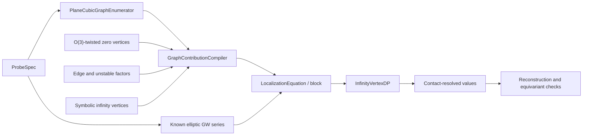

# Roadmap: full log-GLSM equation provider for the plane cubic

## Implementation status

The software architecture in this roadmap is now implemented. In particular,
the repository contains `ProbeSpec`, the shared coefficient ring and dimension
engine, universal CJR factors, a complete base-torus localization backend for
`O(3)`-twisted zero vertices, general lambda/psi integration through
`admcycles`, the per-graph compiler, known elliptic probe values, rank-aware
probe selection, field-valued DP, and audit reports.

The aggregate genus-two computation is end to end and reproduces every
requested coefficient of `<pt psi^2>_(2,1,d)`. The contact-resolved compiler
also keeps `(-3)` and `(-2,-2)` as distinct unknowns.

The former mathematical gap has been closed by
`o3_fixed_locus_graphs.sage`. It enumerates the fixed loci of
`Mbar_(g,n)(P^2,d)`, evaluates their virtual-normal and `O(3)` Euler factors,
and sends all contracted-vertex lambda/psi monomials to the vendored
`admcycles` 1.4 backend. The algorithm is finite for every fixed `(g,n,d)`
but grows exponentially; large degrees and high-valence Hodge integrals are
therefore computational, rather than architectural, limits. A future
quantum-Riemann--Roch/R-matrix implementation remains valuable as a faster
independent backend, not as a correctness prerequisite.

## Target

Given a compact-type elliptic-curve probe and a finite truncation, the final
program should:

1. enumerate every CJR localization graph;
2. attach its exact equivariant contribution;
3. express the result as a polynomial in contact-resolved infinity vertices;
4. obtain the probe's known Gromov--Witten invariant from elliptic-curve
   theory;
5. solve the resulting scalar or block-triangular system with
   `InfinityVertexDP`; and
6. verify the reconstructed invariant, including cancellation of auxiliary
   equivariant parameters.

The first supported scope should remain deliberately precise:

- connected theory of a smooth cubic in `P^2`;
- compact-type ordinary markings and trivial inertia sectors;
- `E=O(3)` with a separate R-torus fiber weight;
- exact rational arithmetic;
- finite bounds on genus, ambient degree, descendant degree, and contact
  length.

The combinatorial and cohomological layers are complete in this scope. The
remaining open-ended work is probe design: finding full-rank families of
known elliptic invariants for every desired contact-resolved DP block, and
improving performance at large `(g,n,d)`.



## Current foundation

The following pieces are already present:

- `cjr_bipartite_graphs.sage`: graph topology, decorations, balancing,
  stability, canonical isomorphism classes, automorphisms, and contact
  profiles;
- `log_glsm_infinity_dp.sage`: exact scalar and block-triangular solving;
- `bo_coefficient.sage`: connected stationary elliptic-curve series;
- `cjr_plane_cubic_equation_provider.sage`: the resummed one-point
  stationary provider and the basic all-`-2` diagonal coefficient;
- `elliptic_cubic_gw.py`: plane-cubic degree conventions and elementary
  equivariant `O(3)` weights.
- `o3_fixed_locus_graphs.sage`: full internal stable-map localization for
  every twisted zero vertex;
- `cjr_graph_contributions.sage`: exact graph-to-effective-polynomial
  compilation;
- `cjr_full_equation_provider.sage`: equation extraction and DP integration.

## Phase 1: freeze conventions and data contracts

This phase should precede further formulas. Most localization bugs are
normalization bugs that otherwise surface only after large graph sums.

### 1.1 `ProbeSpec`

Add an immutable specification containing:

- genus and ambient plane degree;
- labeled ordinary markings;
- for each marking, a cohomology insertion and a psi power;
- connected/disconnected normalization;
- the equivariant coefficient or non-equivariant limit to extract.

For the first implementation, use the basis `(1,H,H^2)` of `H*(P^2)` and a
separate elliptic basis on the known-GW side. The point of the cubic is
represented by `H|_E/3`, since `int_E H=3`; it is not the ambient point class
`H^2`.

### 1.2 coefficient ring

Create one coefficient-ring factory for

```text
QQ(lambda_0, lambda_1, lambda_2, t)
```

and truncated Laurent/power series in the R-weight `t`. No module should
create an independent symbolic `t`. Specializing the base weights to
convenient distinct rational values should be supported as a verification
mode, not as the definition of the answer.

### 1.3 normalization ledger

Record in executable tests:

- positive edge contact `c` versus the negative infinity contact `-c`;
- the reduced-class sign `(-1)^(1-g+3d)`;
- coarse versus orbifold psi classes (trivial here, but still explicit);
- the convention for `psi_min`;
- inverse Poincare pairing and diagonal factors;
- whether `1/|Aut(Gamma)|` is applied by the compiler or the caller;
- connected versus normalized-disconnected elliptic invariants.

**Completion criterion:** a serialized `ProbeSpec` and a single coefficient
ring can be passed unchanged through every later component.

## Phase 2: dimension and truncation engine

Implement a small exact dimension calculator before expanding any
denominators.

It should compute:

- virtual dimensions of the probe, stable zero vertices, and infinity
  vertices;
- cohomological degrees at markings and flags;
- the allowed powers of edge psi classes and `psi_min`;
- the maximum Laurent order in `t` needed from each factor;
- immediate vanishing from dimension, balance, string, divisor, or dilaton
  constraints.

This makes every graph contribution finite. It should return an explicit
reason when pruning a term; silent truncation is not acceptable.

**Completion criterion:** every infinite-looking denominator expansion has a
provably sufficient finite order attached to it.

## Phase 3: exact universal graph factors

Create `cjr_graph_factors.sage` with small independently tested functions.

### 3.1 edges

For an edge of contact `c`, implement the plane-cubic hypersurface factor

```text
c^c / (c! * (t-3H)^c)
```

together with the appropriate evaluation pullback, cotangent denominator,
and basis expansion needed for gluing. Here `H` is the hyperplane class and
`H_infinity=c1(O(3))=3H`. Keep the unspecialized `H` until the cohomology
pairing is applied.

### 3.2 unstable zero vertices

Implement separate functions for:

- nonspecial vertices;
- marked vertices;
- nodal vertices.

The existing identity

```text
edge(c) * nonspecial_leaf(c)
    = c^(c-1) / (c! * (t-3H)^(c-2))
```

must remain a regression test, including the exact cancellation at `c=2`.

### 3.3 gluing and pairings

Implement the diagonal contraction in the chosen cohomology basis. A graph
with several infinity vertices must produce a product of distinct symbolic
`EffectiveVertex` factors, followed by all basis-label sums and the single
automorphism factor supplied by the graph.

**Completion criterion:** all edge and unstable contributions from the CJR
formula can be evaluated without invoking either the twisted stable-vertex
backend or the DP solver.

## Phase 4: `O(3)`-twisted stable zero-level theory

This phase is implemented. The public request interface is
`TwistedZeroVertexRequest`, evaluated by
`FullTwistedZeroVertexBackend`:

```text
twisted_zero_vertex(
    genus, degree,
    ordinary_insertions,
    flag_insertions,
    flag_psi_powers,
    equivariant_parameters
) -> exact coefficient
```

### 4.1 implemented backend: base-torus localization on `P^2`

`P2FixedLocusGraphEnumerator` uses the `(C*)^3` action on `P^2` and enumerates
ordinary stable-map fixed graphs internal to a zero vertex. It includes:

- vertex assignments to the three fixed points;
- invariant-line edge degrees;
- stable-map deformation and smoothing factors;
- the R-equivariant Euler class of `R pi_* f^* O(3)`;
- marking and flag evaluation classes;
- descendant denominators;
- contracted higher-genus vertex Hodge factors;
- internal automorphisms.

This backend is combinatorially expensive but direct and independently
checkable. It is preferable for the first correct implementation.

### 4.2 implemented Hodge-integral backend

The fixed-graph calculation reduces contracted vertices to Hodge/psi
integrals on `Mbar_(g,n)`. The implementation provides:

- genus-zero psi intersections;
- the lambda-g closed formula where applicable;
- `AdmcyclesHodgeIntegralBackend` for arbitrary top-degree products of
  lambda and psi classes.

The lighter `HodgeIntegralBackend` and `TwistedZeroVertexBackend` remain
available for tests that deliberately exercise unsupported-geometry
diagnostics.

### 4.3 second backend: Givental/quantum-Riemann--Roch

After the localization backend is validated, add a semisimple-CohFT backend
using the twisted `I`-function, canonical coordinates, and the `R`-matrix.
This should be an optimization and cross-check, not the first source of
truth.

### 4.4 completed low-degree tests

The tests include the line through two points, the conic through five points,
divisor/string/dilaton equations, the genus-one degree-zero mapping-to-a-point
value `-1/8`, the constant rational twist, and full genus-two degree-zero
evaluation. The conic is checked twice: the standard `H^2` lift sums 1,557
fixed components, while cyclic fixed-point-supported lifts reduce the same
invariant to three components.

**Completion criterion: met.** Every stable zero vertex at fixed finite
`(g,n,d)` has an exact localization algorithm, subject only to available
computing time and memory.

## Phase 5: symbolic infinity-vertex expansion

Create a translator from an enumerated infinity vertex to

```text
EffectiveVertex(g, D, contacts, psi_min=k, insertions=alpha)
```

The current graph enumerator supplies `(g,D,contacts)`. The contribution
compiler must add:

- the finite expansion of `1/(-t-psi_min)`;
- evaluation insertions inherited from incident-edge basis labels;
- symmetry under equal contacts and equal insertions;
- dimension pruning of impossible `psi_min` powers;
- positive infinity degrees when allowed by
  `2g-2 >= 3D` (they first matter beyond the genus-two simplification).

Do not aggregate distinct contact profiles at this layer. Aggregation is
allowed only as an explicitly labeled resummation, as in the current
one-point cumulant provider.

**Completion criterion:** a graph contribution is a finite exact sum of
monomials in fully indexed `EffectiveVertex` objects.

## Phase 6: graph contribution compiler

Implement

```text
compile_graph(probe, graph) -> GraphContribution
```

where `GraphContribution` contains:

- the stable zero-level value;
- the edge and unstable factors;
- the infinity-vertex monomials;
- the automorphism factor;
- a provenance record showing every factor and truncation decision.

Then implement

```text
compile_probe(probe) -> LocalizationEquation
```

by summing over `PlaneCubicGraphEnumerator`. One-level zero graphs contribute
to `twisted_zero_level`; mixed and infinity-level graphs contribute symbolic
monomials.

Important invariants:

- every enumerated graph is included exactly once;
- `1/|Aut(Gamma)|` is applied exactly once;
- all terms live in the same coefficient ring;
- basis-label sums are completed before equal monomials are collected;
- no division by the target diagonal occurs in the compiler.

**Completion criterion:** the output can be passed directly to
`InfinityVertexDP` and can also be printed as an auditable per-graph table.

## Phase 7: known elliptic-curve probe values

Wrap `bo_coefficient.sage` behind

```text
known_elliptic_invariant(ProbeSpec)
```

The first version should support connected stationary insertions and verify:

- the virtual-dimension constraint;
- degree conventions (`d` in `P^2` versus cover degree on the cubic);
- constant-map terms;
- the connected/disconnected conversion;
- string, divisor, and dilaton reductions used to enlarge the probe family.

If resolving a block requires genuinely nonstationary invariants, add them as
a separate backend rather than silently extrapolating the Bloch--Okounkov
formula.

**Completion criterion:** every generated probe is either assigned a proven
known value or rejected before equation construction.

## Phase 8: automatic probe and block selection

A lexicographic order alone does not guarantee a triangular system. Build a
`ProbeFactory` that:

1. receives a target collection of effective vertices;
2. generates dimension-compatible candidate probes;
3. compiles their localization equations;
4. forms the exact diagonal coefficient matrix for each same-rank block;
5. chooses pivot probes by exact row reduction;
6. sends full-rank blocks to `InfinityVertexDP.solve_block`;
7. reports the kernel explicitly if the probes do not separate the desired
   vertices.

Candidate probes should be ordered by cost: stationary point descendants
first, then string/divisor/dilaton relatives, then additional primary or
graph-valued relations.

**Completion criterion:** the program never relies on an arbitrary tie-break
between same-rank vertices and never claims a value from a singular block.

## Phase 9: end-to-end milestones

### Milestone A: reproduce the aggregate base cases

- recover `b_2=-1/24`;
- recover `b_4=1/2880`;
- reconstruct the known one-point series through several `q`-degrees;
- reproduce the all-`-2` star coefficient `1/n_2!` from the generic compiler.

### Milestone B: resolve genus-two contact profiles

For the genus-two one-point graph sum, the enumerator currently finds the
base dependencies

```text
(1,0,(-1))
(1,0,(-1,-1))
(1,0,(-1,-1,-1))
(2,0,(-3))
(2,0,(-3,-1))
(2,0,(-2,-2))
(2,0,(-2,-2,-1))
```

Generate enough probes to determine which of these are individually
recoverable. In particular, replace the aggregate genus-two cumulant by a
full-rank block separating `(-3)` from `(-2,-2)`, or produce an exact kernel
showing why the selected numerical probes cannot do so.

### Milestone C: compute `<pt psi^2>_(2,1,d)` end to end

For successive ambient degrees:

- enumerate the graphs;
- verify that all infinity degrees are zero in genus two;
- calculate the positive-degree `O(3)`-twisted zero vertices;
- solve the required infinity blocks;
- sum the reduced localization formula with its sign;
- compare with `bo_coefficient.sage` for every computed degree.

### Milestone D: arbitrary finite truncations

Accept bounds `(g_max,d_max,n_max,contact_length_max,psi_max)`, construct the
finite dependency closure, select probes block by block, checkpoint solved
values, and resume without recomputing lower data.

## Phase 10: verification and performance

### Mandatory mathematical checks

- CJR low-genus graph counts remain unchanged;
- graph contributions are invariant under vertex relabeling;
- equivariant base weights cancel from final non-equivariant invariants;
- apparent R-weight poles cancel to the predicted order;
- reconstructed GW series agree coefficientwise with independent elliptic
  theory;
- results are unchanged by using distinct generic rational base weights;
- dimension-zero and known vanishing cases return exactly zero;
- all aggregate values are visibly labeled as aggregates.

### Engineering work

- memoize zero-vertex invariants by canonical decorated input;
- cache internal `P^2` fixed graphs and Hodge integrals;
- collect equal `EffectiveVertex` monomials early;
- checkpoint DP values and compiled equations in a versioned exact format;
- add optional progress counters for large finite searches;
- keep a deterministic textual report for every solved block.

## Recommended file layout

```text
log_glsm_conventions.sage          ProbeSpec, rings, signs, dimensions
cjr_graph_factors.sage             edge, unstable, and gluing factors
o3_twisted_plane_vertices.sage     stable zero-vertex interface
o3_fixed_locus_graphs.sage         base-torus localization backend
hodge_integrals.sage               contracted-vertex intersection backend
cjr_graph_contributions.sage       per-graph compiler and provenance
elliptic_probe_values.sage         known GW wrapper
cjr_probe_factory.sage             rank-aware probe selection
cjr_full_equation_provider.sage    end-to-end provider
```

Each file should have a matching `test_*.sage` suite. The existing generic DP
and graph enumerator should stay independent of the geometric backends.

## Main mathematical risks

1. **Probe sufficiency.** Stationary numerical invariants may determine only
   aggregate combinations of contact profiles. Exact block-rank computation
   must decide this rather than assumption.
2. **Twisted higher-genus vertices.** A complete Hodge-integral backend is
   needed for unrestricted genus, even with unlimited graph-enumeration time.
3. **Descendant normalization.** `psi_min`, stabilization pullbacks, and
   unstable conventions must be derived consistently before comparing
   coefficients.
4. **Positive infinity degree.** It vanishes in the genus-two application but
   must remain in the general design.
5. **Scope expansion.** Noncompact markings, nontrivial sectors, orbifold
   targets, and bundles other than `O(3)` require new graph decorations; they
   should not be folded implicitly into the first provider.

## Definition of done

The equation provider is complete for a finite truncation only when it can
produce, for every selected probe:

- the complete canonical graph list;
- an inspectable exact contribution for every graph;
- a known GW right-hand side;
- a full-rank diagonal block or a certified unresolved kernel;
- solved contact-, insertion-, and descendant-resolved infinity vertices;
- coefficientwise reconstruction checks; and
- successful cancellation of auxiliary equivariant parameters.
